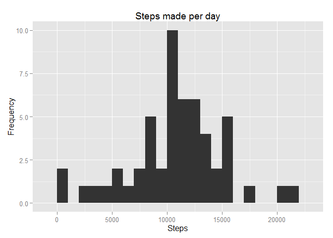
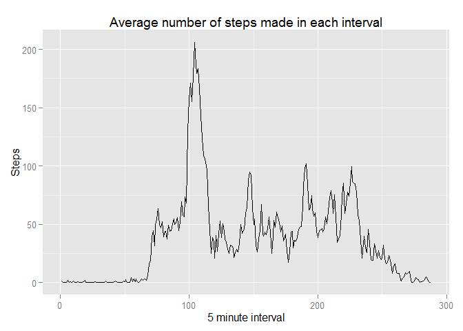
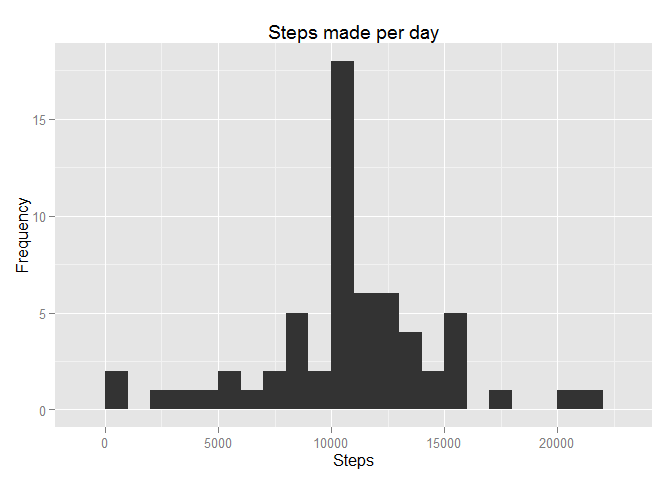
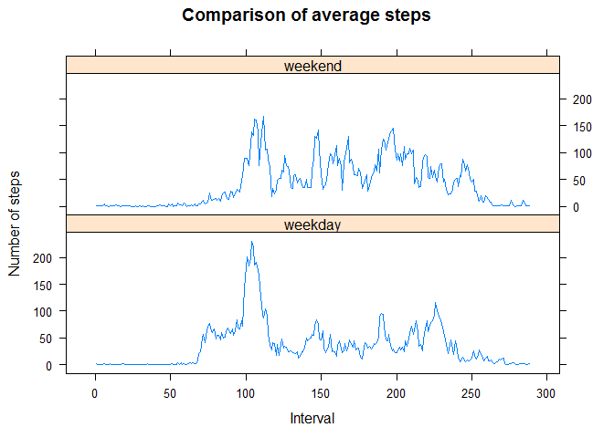

# Reproducible Research: Peer Assessment 1


## Loading and preprocessing the data

First, you need to create a directory with a file activity.csv in it, it can be downloaded from [here][1]. Read the file.

```r
activity <- read.csv("~/R/RR/Project 1/activity.csv")
```
Then we have to tansform a little bit our data. First, parse date variable into date format.

```r
activity$date <- as.Date(activity$date)
```

## What is mean total number of steps taken per day?

Summarize our data set to get total steps made each day.

```r
library(dplyr)
stepsDaily_df <- activity %>%
                 group_by(date) %>%
                 summarize(stepsDaily = sum(steps))
```
After that make a plot of our daily data.

```r
library(ggplot2)
qplot(stepsDaily, data = stepsDaily_df, geom = "histogram",
      main = "Steps made per day", binwidth = 1000, xlab = "Steps", ylab =
              "Frequency")
```


Finally, compute the mean and median amount of steps taken during the day.

```r
mean(stepsDaily_df$stepsDaily, na.rm = TRUE)
```

```
## [1] 10766.19
```

```r
median(stepsDaily_df$stepsDaily, na.rm = TRUE)
```

```
## [1] 10765
```

## What is the average daily activity pattern?

To answer this question, let's first create a factor variable `interval_f` which would help us to calculate average amount of steps taken in that interval throughout all days. 

```r
activity$interval_f <- as.factor(activity$interval)
```
Calculate averages based on this variable.

```r
averages <- activity %>%
            group_by(interval_f) %>%
            summarize(avInInterval = mean(steps, na.rm = TRUE))
```
On this plot we can see a patern of a daily activity.

```r
qplot(as.integer(interval_f), avInInterval, data = averages, geom = "line", main
      = "Average number of steps made in each interval",
      xlab = "5 minute interval", ylab = "Steps")
```


And here we can see an interval of time when an average amount of steps taken is the largest.

```r
averages[averages$avInInterval == max(averages$avInInterval), ]
```

```
## Source: local data frame [1 x 2]
## 
##   interval_f avInInterval
## 1        835     206.1698
```

## Imputing missing values

Let's first find how many values are missing. `TRUE` corresponds to missing values.

```r
library(xtable)
xt <- xtable(table(is.na(activity$steps)))
print(xt, type = "html")
```

<!-- html table generated in R 3.1.2 by xtable 1.7-4 package -->
<!-- Sun May 17 22:27:27 2015 -->
<table border=1>
<tr> <th>  </th> <th> V1 </th>  </tr>
  <tr> <td align="right"> FALSE </td> <td align="right"> 15264 </td> </tr>
  <tr> <td align="right"> TRUE </td> <td align="right"> 2304 </td> </tr>
   </table>
Make a copy of current data frame.

```r
activity2 <- activity
```
Then, instead of missing let's put an average amount of steps corresponding to a particular time interval. We are seeking for missing value in `steps` variable from `activity` data frame and finding a corresponding time interval. For that interval take an average amount of steps from `averages` data frame.

```r
for (i in 1:17568){
        if (is.na(activity$steps[i])){
                a <- activity$interval_f[i]
                activity$steps[i] <- averages[averages$interval_f == a, 2]
        }
}
```
Transform a list into a vector.

```r
activity$steps <- c(do.call("cbind", activity$steps))
```
Then we are going to do the same steps as we've done when answering the question 1 but now without missing values.

```r
stepsDaily_df2 <- activity %>%
                  group_by(date) %>%
                  summarize(stepsDaily2 = sum(steps))
qplot(stepsDaily2, data = stepsDaily_df2, geom = "histogram", main = "Steps made per day",
      binwidth = 1000, xlab = "Steps", ylab = "Frequency")
```



```r
mean(stepsDaily_df2$stepsDaily2)
```

```
## [1] 10766.19
```

```r
median(stepsDaily_df2$stepsDaily2)
```

```
## [1] 10766.19
```
Now we can see that mean and median of steps taken per day didn't change. It also seems that frequency of steps taken between 10000 and 11000 has increased.

## Are there differences in activity patterns between weekdays and weekends?
First, let's create a factor variable with two levels depending on whether the day is weekday or weekend.

```r
for (i in 1:17568) {
        if (weekdays(activity$date[i]) %in% c("субота", "неділя")){
                activity$weekd[i] <- "weekend"
        } else{
                activity$weekd[i] <- "weekday"
        }             
}
activity$weekd <- as.factor(activity$weekd)
```
Then let's calculate average amount of steps for each interval split the results based on factor variable created above.

```r
averages2 <- activity %>%
             group_by(interval_f, weekd) %>%
             summarize(avInInterval2 = mean(steps))
```
Finally, let's make a plot.

```r
library(lattice)
xyplot(avInInterval2 ~ as.integer(interval_f) | weekd, data = averages2, type = "l",
       main = "Comparison of average steps", xlab = "Interval", ylab = "Number of steps",
       layout = c(1, 2))
```


As we can see from the plot, people tend to move more during the whole day on weekends. At the same time there is a large moving activity in the morning of week days (larger than during the weekends mornings).

[1]: https://d396qusza40orc.cloudfront.net/repdata%2Fdata%2Factivity.zip
